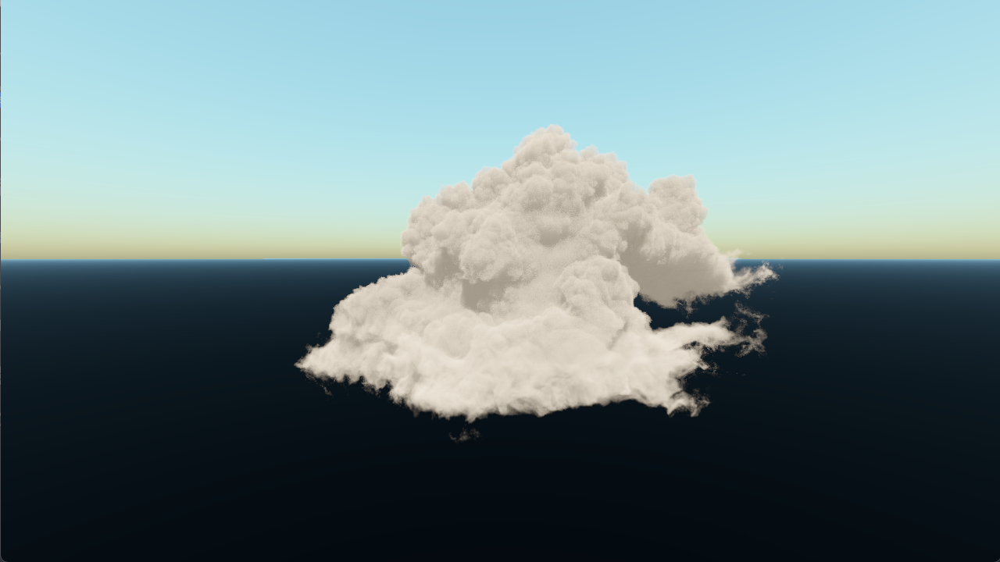

# A simple real-time volumetric cloud renderer


## Usage

Ensure that `uv` is installed and run `uv sync` in the command line.

This project requires a download of the cloud dataset provided by Disney.

The cloud dataset can be downloaded from [here](https://media.disneyanimation.com/uploads/production/data_set_asset/1/asset/Cloud_Readme.pdf).

To convert this to a `.npy` file, use the `convert.py` script. This script assumes that the package `openvdb` is installed. This is currently only available on conda-forge, so a conda environment may be needed.

Example script usage:
```bash
python convert.py wdas_cloud_quarter.vdb cloud_4.npy
```

Ensure that the `.npy` file is placed in the root directory of this project.

To run the renderer:
```bash
python main.py
```

## Example Renders


